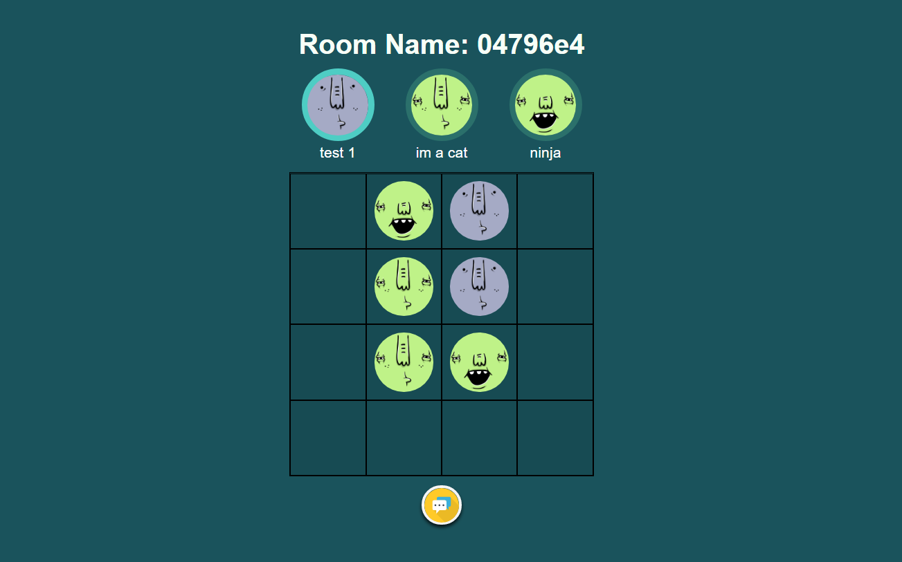

# TicTacMul

A multiplayer tictactoe game make by nodejs,socket.io and vuejs.


## Live Demos

[Heroku](https://tictacmul.herokuapp.com/)

## How to play

The first player to get 3 of their marks in a row (up, down, across, or diagonally) is the winner.

## Installation
### Downloading the dependencies
After cloning the source code from Github, you need to run the following command to download all the dependencies (socket.IO, express, etc.):
```bash
npm install
```
### Run server:
```bash
npm run start
```
The game will then be accessible at http://localhost:5000 or the respective server installed on. The default port is 5000, however this can be changed in index.js


## For Developers
If you change the code in client folder, remember to run
```bash
npm run build
```

## Contributing

Pull requests are welcome. For major changes, please open an issue first to discuss what you would like to change.

## License

[MIT](https://choosealicense.com/licenses/mit/)
